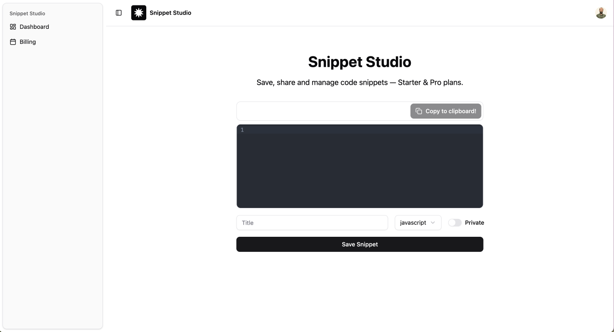

# ✨ Snippet Studio

[](https://snippet-studio-lovat.vercel.app/)
[](https://convex.dev/)
[](https://stripe.com/)
[](https://clerk.com/)
[](./LICENSE)

Snippet Studio is a simple yet powerful **code snippet manager** where developers can create, save, and share code snippets.  
It features **syntax highlighting, public/private snippet sharing, authentication, and a paywall** for premium users.  

🚀 Live at: [snippet-studio-lovat.vercel.app](https://snippet-studio-lovat.vercel.app/)

---

## 📸 Screenshots



---

## ⚡ Features

- 🔐 **Authentication with Clerk** (sign up, login, user management)
- 💾 **Convex Database** for real-time data storage
- 📝 **Code Editing & Highlighting** using CodeMirror + Highlight.js
- 🌗 **Dark/Light Theme Toggle** with `next-themes` + shadcn/ui
- 👥 **Public and Private Snippets**  
  - Public snippets → anyone can view  
  - Private snippets → only owner can access
- 💳 **Stripe Paywall**  
  - Free plan → up to **9 snippets**  
  - Pro plan → **Unlimited snippets**
- 📱 **Responsive UI** built with Next.js 15 + App Router + shadcn/ui
- 🚀 Deployed on **Vercel** with Convex running in **production mode**

---

## 🛠️ Tech Stack

- **Frontend:** [Next.js 15](https://nextjs.org/), [React](https://react.dev/), [TypeScript](https://www.typescriptlang.org/)  
- **Styling/UI:** [TailwindCSS](https://tailwindcss.com/), [shadcn/ui](https://ui.shadcn.com/)  
- **Code Highlighting:** [Highlight.js](https://highlightjs.org/), [CodeMirror](https://codemirror.net/)  
- **Database & Backend:** [Convex](https://convex.dev/)  
- **Auth:** [Clerk](https://clerk.com/)  
- **Payments:** [Stripe](https://stripe.com/)  
- **Deployment:** [Vercel](https://vercel.com/) + Convex prod deployment  

---

## 🚀 Getting Started

### 1. Clone the repo
```bash
git clone https://github.com/yourusername/snippet-studio.git
cd snippet-studio
```
### 2. Install Dependencies
```bash
yarn install
```

### 3. Setup .env
```bash
NEXT_PUBLIC_CONVEX_URL=<your-convex-deployment-url>
NEXT_PUBLIC_CLERK_PUBLISHABLE_KEY=<your-clerk-publishable-key>
CLERK_SECRET_KEY=<your-clerk-secret-key>

STRIPE_SECRET_KEY=<your-stripe-secret>
STRIPE_WEBHOOK_SECRET=<your-stripe-webhook-secret>
NEXT_PUBLIC_STRIPE_PRO_PRICE_ID=<stripe-price-id-for-pro>
```

### 4. Run Convex locally
```bash
npx convex dev
```
### 5. Start App
```bash
yarn dev #(frontend+backend)
yarn dev:frontend #frontend(standalone)
yarn dev:backend #backend convex(standalone)
```
